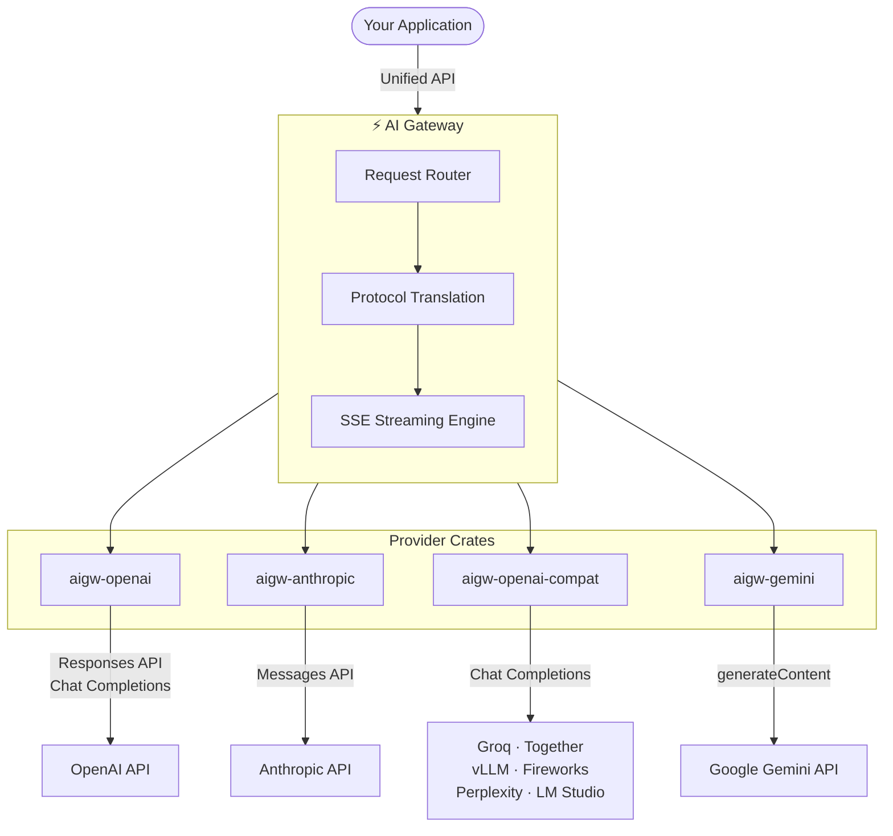

<div align="center">

# ⚡ AI Gateway

**A protocol-faithful, multi-provider AI gateway written in Rust.**

Route requests across OpenAI, Anthropic, Google Gemini, and the entire OpenAI-compatible ecosystem — with native wire types, streaming SSE, and zero lowest-common-denominator abstractions.

[](https://github.com/AprilNEA/aigateway/actions/workflows/ci.yml)
[](LICENSE)


</div>

---

## Why AI Gateway?

Most multi-provider LLM wrappers force every provider into a single "universal" message format, silently dropping fields and features along the way. AI Gateway takes the opposite approach:

- **Protocol-faithful** — Each provider crate models the upstream API exactly as documented. No fields are silently dropped, no semantics are lost.
- **Forward-compatible** — All wire types carry `#[serde(flatten)] extra` to survive upstream API changes without recompilation.
- **Translation at the edge** — Cross-provider mapping happens at the gateway layer via `TryFrom`/`Into`, not inside individual providers.
- **Streaming-first** — Full SSE event fidelity for every provider.

## Architecture



## Supported Providers

<table>
  <tr>
    <th></th>
    <th>Provider</th>
    <th>Crate</th>
    <th>Chat</th>
    <th>Streaming</th>
    <th>Status</th>
  </tr>
  <tr>
    <td></td>
    <td><b>OpenAI</b></td>
    <td><a href="providers/aigw-openai/"><code>aigw-openai</code></a></td>
    <td>✅</td>
    <td>✅</td>
    <td>🚧 Active</td>
  </tr>
  <tr>
    <td></td>
    <td><b>Anthropic</b></td>
    <td><a href="providers/aigw-anthropic/"><code>aigw-anthropic</code></a></td>
    <td>✅</td>
    <td>✅</td>
    <td>🚧 Active</td>
  </tr>
  <tr>
    <td></td>
    <td><b>Google Gemini</b></td>
    <td><a href="providers/aigw-gemini/"><code>aigw-gemini</code></a></td>
    <td>–</td>
    <td>–</td>
    <td>🏗️ Skeleton</td>
  </tr>
</table>

### OpenAI-Compatible Providers via [`aigw-openai-compat`](providers/aigw-openai-compat/)

Configure any OpenAI-compatible provider with a `base_url` + `Quirks` capability flags — no new crate needed.

<p>
  &ensp;
  &ensp;
  &ensp;
  &ensp;
  &ensp;
  &ensp;
  
</p>

> **Adding a new provider?** If the API is OpenAI-compatible, add a `Quirks` config to `aigw-openai-compat`. Only create a new crate for providers with a distinct wire format.

## Design Principles

### No universal message type

Each provider crate defines its own native request/response types mirroring the upstream API. Translation between providers is handled via `TryFrom`/`Into` at the gateway layer.

### Quirks-based compat

Third-party OpenAI-compatible providers declare their capabilities through a `Quirks` struct. Unsupported fields are stripped before sending, not silently ignored.

```rust
Quirks {
    supports_responses_api: false,
    supports_tool_choice: true,
    supports_parallel_tool_calls: false,
    supports_vision: true,
    supports_streaming: true,
}
```

### Secrets never leak

API keys are stored as `secrecy::SecretString` — they never implement `Debug`, never appear in logs.

## Quick Start

```bash
cargo build --workspace         # Build
cargo test --workspace          # Test
cargo clippy --workspace        # Lint
```

See [**CONTRIBUTING.md**](CONTRIBUTING.md) for the full development guide, code conventions, and how to add new providers.

## License

[MIT](LICENSE)
